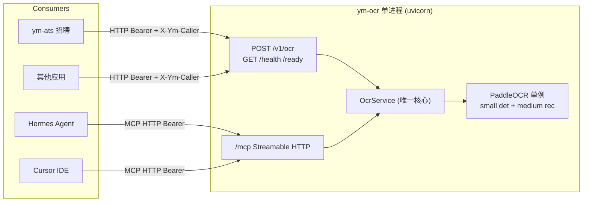

# ym-ocr · 平台 OCR 服务

独立 OCR 平台服务：单进程加载一份 PP-OCRv6，同时提供 **REST** 与 **MCP**，供 ym-ats 等应用调用，也可被 Hermes 直接接入。

定位：**平台 OCR 引擎**，只管识别，不管简历/用户/匹配等业务。私有化部署优先本地推理，云端仅作各应用可选 fallback。

## 架构



- 一个 uvicorn 进程，一份 GPU 显存
- REST 与 MCP 都是 `OcrService.recognize()` 的薄适配，不互相 HTTP 调用
- 模型单例在 lifespan 加载一次，MCP session manager 与 engine lifespan 合并
- 默认场景：**清晰印刷截图** → `OCR_DET_MODEL=PP-OCRv6_small` + `OCR_REC_MODEL=PP-OCRv6_medium`（可改）
- 每次识别打日志：`caller` / `via` / `file` / `bytes` / `pages` / `lines` / `elapsed_ms`

## 目录结构（最少文件）

```
ym-ocr/
├── app/
│   ├── main.py          # FastAPI + mount /mcp + lifespan 合并
│   ├── config.py        # 环境变量读取（pydantic-settings）
│   ├── schemas.py       # OcrResponse / OcrMeta 契约
│   ├── ocrService.py    # 核心：recognize(bytes, filename)
│   ├── textNormalize.py # 识别出口字形减噪（NFKC/全角半角）
│   ├── softWrap.py      # bbox 软换行合并（布局启发）
│   ├── engine.py        # PaddleOCR 单例 + predict 封装
│   ├── rest.py          # POST /v1/ocr, GET /health, /ready
│   └── mcpServer.py     # FastMCP + 2 个 tool → ocrService
├── client/
│   └── ymOcrClient.py   # 给各应用复用的极简 Python SDK
├── models/              # 本地模型权重（git 排除）
│   └── .gitkeep
├── samples/             # 测试用图片/PDF（git 排除）
├── pyproject.toml
├── .gitignore
├── .env.example
└── README.md
```

## 本地模型 + .gitignore

沿用 apiYmy `ocrSvc.py` 的本地模型目录模式，避免每次启动联网下载：

- 模型权重放 `ym-ocr/models/`（det + rec 两个子目录）
- 首次启动若 `OCR_MODEL_DIR` 下对应子目录存在则用本地，否则由 PaddleOCR 自动下载到该目录
- **`.gitignore` 排除**：`models/`、`samples/`、`.venv/`、`__pycache__/`、`.env`、`output/`、`*.log`
- 新机器首次启动自动下载，或从已部署机器 `rsync -av models/ user@host:ym-ocr/models/` 拷贝

```gitignore
.venv/
__pycache__/
*.py[oc]
.env
models/
samples/
output/
*.log
```

## 安装与启动

### PaddlePaddle（GPU / CUDA 12.9）

默认 `paddlepaddle-gpu==3.3.0`（与 CPU 版 `paddlepaddle` 互斥，勿同环境混装）。从飞桨源安装：

```bash
python -m pip install paddlepaddle-gpu==3.3.0 -i https://www.paddlepaddle.org.cn/packages/stable/cu129/
```

需本机 NVIDIA 驱动 + CUDA 12.9。仅 CPU 时改用 `paddlepaddle==3.3.0`（PyPI）。

### 其余依赖

```bash
uv sync
cp .env.example .env
# 编辑 .env：至少填 YM_OCR_API_KEY
```

依赖清单（写入 `pyproject.toml`）：

- `fastapi`、`uvicorn`
- `paddlepaddle-gpu==3.3.0`、`paddleocr`（含 paddlex）
- `mcp>=1.6.0`（FastMCP）
- `pydantic-settings`、`httpx`
- `pillow`、`numpy`、`pymupdf`（PDF 渲染）

### 启动

```bash
# 开发：前台
uv run ocr.py

# 或后台脚本
bash scripts/start.sh
```

**生产 / 开机自启（systemd）：**

```bash
# 用户级服务（推荐，无需 sudo）
bash scripts/install-service.sh

# 系统级服务（需 sudo，多用户机器）
sudo cp deploy/ym-ocr.service /etc/systemd/system/
sudo systemctl daemon-reload && sudo systemctl enable --now ym-ocr

# 手动管理（用户级）
systemctl --user status ym-ocr
systemctl --user restart ym-ocr
journalctl --user -u ym-ocr -f
```

服务单元：[`deploy/ym-ocr.user.service`](deploy/ym-ocr.user.service)（用户级）、[`deploy/ym-ocr.service`](deploy/ym-ocr.service)（系统级）

- REST：`http://127.0.0.1:8001/v1/ocr`
- MCP：`http://127.0.0.1:8001/mcp`
- 调用方标识：REST 请求头 `X-Ym-Caller: ym-ats`（缺省则用 User-Agent@IP）；MCP tool 参数 `caller`

首次启动会用 `models/` 下的本地模型；若模型缺失则自动联网下载到 `models/`（需网络可达百度 bos / aistudio / huggingface）。

WSL2 注意：若日志出现 `Switching to CPU`，是 NVML 初始化问题；在非 sandbox 进程里启动可正常用 GPU。

## 核心实现要点

### engine.py — PaddleOCR 单例（最少显存）

- `import paddle/paddlex` 前设 `PADDLE_PDX_DISABLE_MODEL_SOURCE_CHECK=True`、`FLAGS_use_mkldnn=0`、`FLAGS_fraction_of_gpu_memory_to_use=0.5`（CPU 兼容 + 降 GPU 显存池）
- `PaddleOCR(use_doc_orientation_classify=False, use_doc_unwarping=False, use_textline_orientation=False, device=OCR_DEVICE, precision="fp16", text_det_limit_side_len=1280, text_det_limit_type="max", text_recognition_batch_size=1)`
- det/rec 可分开：`OCR_DET_MODEL` / `OCR_REC_MODEL`（空则跟随 `OCR_MODEL`）
- 本地模型目录优先：`models/{det}_det`、`models/{rec}_rec`；缺失则自动下载
- 全局单例，`initEngine()`/`shutdownEngine()` 由 lifespan 调用

```python
detModel = effectiveDetModel()  # OCR_DET_MODEL or OCR_MODEL
recModel = effectiveRecModel()
detDir = Path(OCR_MODEL_DIR) / f"{detModel}_det"
recDir = Path(OCR_MODEL_DIR) / f"{recModel}_rec"
```

### ocrService.py — 唯一核心

- `recognize(fileBytes: bytes, filename: str) -> OcrResponse`
- 图片：`PIL.Image` → `np.array` → `engine.predict`
- PDF：`fitz.open(stream)` → 逐页 `get_pixmap(matrix=1.5)` → `engine.predict`，合并结果，限 50 页
- 合并 `rec_texts` 列表，消费方按需 `"\n".join(rec_texts)` 取全文
- **字形减噪**（默认开，`OCR_TEXT_NORMALIZE`）：出 `rec_texts` 前做 NFKC + 全角半角 + 零宽剥离；对齐 apiYmy `ocr_text_normalize` / Unicode NFKC；**不做**简历水印关键词过滤（仍由消费方 S0）
- **软换行合并**（默认开，`OCR_SOFT_WRAP`）：有 `rec_boxes` 时，同列竖直相邻且有续写信号则合并行并合并包围盒；`meta.soft_wrap_merges` 记次数；**不做**简历业务拒识（可行性报告等仍由 ym-ats）。续写正则与 ym-ats `softWrap.py` 对齐（ats 为文本启发式 SSOT）
- `asyncio.Semaphore(OCR_MAX_CONCURRENT)` 限并发（默认 2），GPU 防爆

### schemas.py — 全平台契约

```python
class OcrMeta(BaseModel):
    pages: int = 1
    elapsed_ms: int = 0
    model: str = "PP-OCRv6_small"

class OcrResponse(BaseModel):
    code: int = 200
    message: str = ""
    rec_texts: list[str] = []
    rec_boxes: list[list[int]] = []
    meta: OcrMeta
```

字段对齐 Paddle 官方 `prunedResult`（snake_case）：`rec_texts` / `rec_boxes`；全文由消费方 `"\n".join(rec_texts)` 推导。

### rest.py — REST 适配

- `POST /v1/ocr`：multipart `file` + 可选 `layout`（`legacy`|`columns`|`auto`，默认 `legacy`），Bearer 鉴权
  - `legacy`：行按 `(y,x)` 排序（历史行为；Boss 截图等保持此默认）
  - `columns`：有竖缝时先左栏再右栏；无缝仍按 legacy
  - `auto`：能检出双栏则分栏，否则 legacy（ym-ats 简历 PDF 使用）
  - 响应 `meta.reading_order`：实际采用的 `legacy`|`columns`
- `GET /health`：进程存活；`GET /ready`：engine 已加载

### mcpServer.py — MCP 适配

- `FastMCP("ym-ocr")`
- 2 个 tool，均调 `ocrService.recognize`：
  - `ocr_recognize_file(file_path: str)` — 本机路径
  - `ocr_recognize_base64(file_base64: str, filename: str)` — base64
- 返回 `json.dumps(OcrResponse.model_dump(), ensure_ascii=False)`
- Hermes 显示为 `ym-ocr__ocr_recognize_*`

### main.py — 入口（lifespan 合并）

```python
mcp_app = mcp.http_app(path="/")

@asynccontextmanager
async def lifespan(app):
    initEngine()
    async with mcp_app.lifespan(app):
        yield
    shutdownEngine()

app = FastAPI(lifespan=lifespan)
app.mount("/mcp", mcp_app)
app.include_router(rest.router)
```

## 环境变量

| 变量 | 默认 | 说明 |
|------|------|------|
| `YM_OCR_HOST` | 127.0.0.1 | 绑定地址 |
| `YM_OCR_PORT` | 8001 | 端口 |
| `YM_OCR_API_KEY` | （必填） | Bearer 共享密钥 |
| `OCR_DEVICE` | gpu:0 | 留空自动探测 |
| `OCR_MODEL` | PP-OCRv6_small | det/rec 未单独指定时的默认档 |
| `OCR_DET_MODEL` | （空=跟随 OCR_MODEL） | 检测模型，如 PP-OCRv6_small |
| `OCR_REC_MODEL` | （空=跟随 OCR_MODEL） | 识别模型，如 PP-OCRv6_medium |
| `OCR_MODEL_DIR` | ./models | 本地模型根目录（git 排除） |
| `OCR_DET_LIMIT_SIDE_LEN` | 1280 | 检测最长边上限，降显存 |
| `OCR_MAX_CONCURRENT` | 2 | 推理并发上限 |
| `OCR_PDF_MAX_PAGES` | 50 | PDF 页数上限 |
| `OCR_PDF_RENDER_SCALE` | 1.5 | PDF 渲染 DPI 倍率 |
| `OCR_TEXT_NORMALIZE` | true | 识别出口字形减噪（NFKC/全角半角/零宽）；无业务过滤 |
| `OCR_SOFT_WRAP` | true | bbox 软换行合并；无盒则跳过；`meta.soft_wrap_merges` |

## 接入方式

### 1. REST（给 ym-ats 等应用）

```python
# client/ymOcrClient.py
from client.ymOcrClient import YmOcrClient

client = YmOcrClient(baseUrl="...", apiKey="...", caller="my-app")
res = await client.ocrFile(data, "shot.png")
# 全文："\n".join(res["rec_texts"])
```

新应用接入 = 配 `YM_OCR_BASE_URL` + `YM_OCR_API_KEY` + 复制此文件（或设 `X-Ym-Caller`）。

### 2. MCP（给 Cursor / Claude Desktop）

在 MCP client 配置中加：

```json
{
  "mcpServers": {
    "ym-ocr": {
      "url": "http://127.0.0.1:8001/mcp",
      "headers": { "Authorization": "Bearer <YM_OCR_API_KEY>" }
    }
  }
}
```

### 3. Hermes（HTTP Streamable）

`~/.hermes/config.yaml`：

```yaml
mcp_servers:
  ym-ocr:
    url: "http://127.0.0.1:8001/mcp"
    headers:
      Authorization: "Bearer ${YM_OCR_API_KEY}"
    timeout: 180
    connect_timeout: 30
```

或 `hermes mcp add ym-ocr --url http://127.0.0.1:8001/mcp`（用户自行执行）。

## 与 apiYmy / ym-ats 的关系

| 服务 | 层级 | 职责 | local 路径 |
|------|------|------|------------|
| ym-ocr | 平台 | 纯 OCR，无用户/无业务 | 本服务 |
| ym-ats | 应用 | 匹配/CRM；`RemoteYmOcrGateway` | `YM_OCR_BASE_URL` → REST |
| apiYmy | 应用 | 门面 `ocrProviderSvc` local/cloud/auto | 配 `YM_OCR_BASE_URL` 后 local 走 ym-ocr；未配则回退进程内 Paddle |
| Hermes | 编排 | MCP tools | `~/.hermes/config.yaml` → `/mcp` |

apiYmy 进程内 Paddle 仍可作回退；确认 ym-ocr 稳定后可再卸 `paddlepaddle-gpu`。

## 模型档位

默认（截图清晰印刷、显存紧）：**small det + medium rec**。统一档位时清空 `OCR_DET_MODEL`/`OCR_REC_MODEL`，只设 `OCR_MODEL`。

## 参考来源

| 来源 | 关键点 | 吸收方式 |
|------|--------|----------|
| `apiYmy/app/ab/services/ocrSvc.py` | 环境变量前置、`FLAGS_use_mkldnn=0`、本地模型目录、PDF 渲染参数 | engine.py 复用同模式，PP-OCRv6 |
| `apiYmy/app/ab/services/paddleOcrCloudSvc.py` | 官方 sync API 调用、结果解析 | ym-ocr 本地优先，cloud 不内置 |
| Obsidian `05-projects/recruit-私有化套件/架构复盘-2026-06-17.md` | 私有化部署、简历/截图不宜上公共云 | ym-ocr 定位为本地平台服务 |
| Obsidian `projects/apiYmy/mirror/docs/recruit/requirements-v1.md` §6 | OCR 双轨 local/cloud/auto | ym-ocr = local 实现；auto/cloud 留在各应用 |
| Obsidian `projects/apiYmy/mirror/README.md` | paddlepaddle-gpu cu129 源、uv 配置 | 依赖与安装说明沿用 |
| `apiYmy/integrations/mcp/abRecruitServer.py` | FastMCP tool 模式、`_asJson` 返回 | mcpServer.py 同模式 |
| `~/.hermes/hermes-agent/tools/mcp_tool.py` | Hermes 支持 stdio / HTTP Streamable / SSE | 优先 HTTP Streamable 连 ym-ocr |
