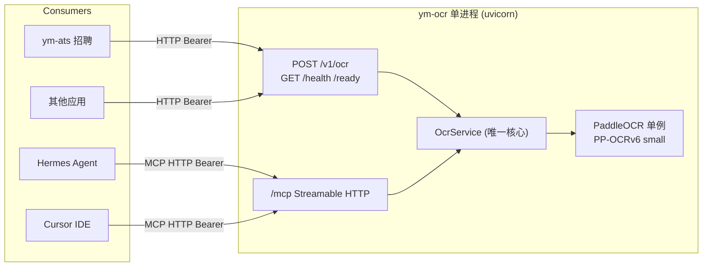

# ym-ocr · 平台 OCR 服务

独立 OCR 平台服务：单进程加载一份 PP-OCRv6，同时提供 **REST** 与 **MCP**，供 ym-ats 等应用调用，也可被 Hermes 直接接入。

定位：**平台 OCR 引擎**，只管识别，不管简历/用户/匹配等业务。私有化部署优先本地推理，云端仅作各应用可选 fallback。

## 架构



- 一个 uvicorn 进程，一份 GPU 显存
- REST 与 MCP 都是 `OcrService.recognize()` 的薄适配，不互相 HTTP 调用
- 模型单例在 lifespan 加载一次，MCP session manager 与 engine lifespan 合并

## 目录结构（最少文件）

```
ym-ocr/
├── app/
│   ├── main.py          # FastAPI + mount /mcp + lifespan 合并
│   ├── config.py        # 环境变量读取（pydantic-settings）
│   ├── schemas.py       # OcrResponse / OcrMeta 契约
│   ├── ocrService.py    # 核心：recognize(bytes, filename)
│   ├── engine.py        # PaddleOCR 单例 + predict 封装
│   ├── rest.py          # POST /v1/ocr, GET /health, /ready
│   └── mcpServer.py     # FastMCP + 2 个 tool → ocrService
├── client/
│   └── ymOcrClient.py   # 给各应用复用的极简 Python SDK
├── models/              # 本地模型权重（git 排除）
│   └── .gitkeep
├── samples/             # 测试用图片/PDF（git 排除）
├── pyproject.toml
├── .gitignore
├── .env.example
└── README.md
```

## 本地模型 + .gitignore

沿用 apiYmy `ocrSvc.py` 的本地模型目录模式，避免每次启动联网下载：

- 模型权重放 `ym-ocr/models/`（det + rec 两个子目录）
- 首次启动若 `OCR_MODEL_DIR` 下对应子目录存在则用本地，否则由 PaddleOCR 自动下载到该目录
- **`.gitignore` 排除**：`models/`、`samples/`、`.venv/`、`__pycache__/`、`.env`、`output/`、`*.log`
- 新机器首次启动自动下载，或从已部署机器 `rsync -av models/ user@host:ym-ocr/models/` 拷贝

```gitignore
.venv/
__pycache__/
*.py[oc]
.env
models/
samples/
output/
*.log
```

## 安装与启动

### PaddlePaddle（GPU / CUDA 12.9）

默认 `paddlepaddle-gpu==3.3.0`（与 CPU 版 `paddlepaddle` 互斥，勿同环境混装）。从飞桨源安装：

```bash
python -m pip install paddlepaddle-gpu==3.3.0 -i https://www.paddlepaddle.org.cn/packages/stable/cu129/
```

需本机 NVIDIA 驱动 + CUDA 12.9。仅 CPU 时改用 `paddlepaddle==3.3.0`（PyPI）。

### 其余依赖

```bash
uv sync
cp .env.example .env
# 编辑 .env：至少填 YM_OCR_API_KEY
```

依赖清单（写入 `pyproject.toml`）：

- `fastapi`、`uvicorn`
- `paddlepaddle-gpu==3.3.0`、`paddleocr`（含 paddlex）
- `mcp>=1.6.0`（FastMCP）
- `pydantic-settings`、`httpx`
- `pillow`、`numpy`、`pymupdf`（PDF 渲染）

### 启动

```bash
# 方式一：直接用 venv
.venv/bin/uvicorn app.main:app --host 127.0.0.1 --port 8001

# 方式二：uv
uv run uvicorn app.main:app --host 127.0.0.1 --port 8001

# 方式三：启动脚本（后台）
bash scripts/start.sh
```

- REST：`http://127.0.0.1:8001/v1/ocr`
- MCP：`http://127.0.0.1:8001/mcp`

首次启动会用 `models/` 下的本地模型；若模型缺失则自动联网下载到 `models/`（需网络可达百度 bos / aistudio / huggingface）。

WSL2 注意：若日志出现 `Switching to CPU`，是 NVML 初始化问题；在非 sandbox 进程里启动可正常用 GPU。

## 核心实现要点

### engine.py — PaddleOCR 单例（最少显存）

- `import paddle/paddlex` 前设 `PADDLE_PDX_DISABLE_MODEL_SOURCE_CHECK=True`、`FLAGS_use_mkldnn=0`、`FLAGS_fraction_of_gpu_memory_to_use=0.5`（CPU 兼容 + 降 GPU 显存池）
- `PaddleOCR(use_doc_orientation_classify=False, use_doc_unwarping=False, use_textline_orientation=False, device=OCR_DEVICE, precision="fp16", text_det_limit_side_len=1280, text_det_limit_type="max", text_recognition_batch_size=1)`
- 模型档位由 `OCR_MODEL` 控制（默认 `PP-OCRv6_small`，可切 `medium`/`tiny`）
- 本地模型目录优先：`text_detection_model_dir`/`text_recognition_model_dir` 指向 `OCR_MODEL_DIR` 下子目录（若存在）
- 全局单例，`initEngine()`/`shutdownEngine()` 由 lifespan 调用

```python
detDir = Path(config.OCR_MODEL_DIR) / f"{config.OCR_MODEL}_det"
recDir = Path(config.OCR_MODEL_DIR) / f"{config.OCR_MODEL}_rec"
kw = {
    "text_detection_model_dir": str(detDir) if detDir.exists() else None,
    "text_recognition_model_dir": str(recDir) if recDir.exists() else None,
    # ...其余参数
}
```

### ocrService.py — 唯一核心

- `recognize(fileBytes: bytes, filename: str) -> OcrResponse`
- 图片：`PIL.Image` → `np.array` → `engine.predict`
- PDF：`fitz.open(stream)` → 逐页 `get_pixmap(matrix=1.5)` → `engine.predict`，合并结果，限 50 页
- 合并 `rec_texts` 列表，消费方按需 `"\n".join(rec_texts)` 取全文
- `asyncio.Semaphore(OCR_MAX_CONCURRENT)` 限并发（默认 2），GPU 防爆

### schemas.py — 全平台契约

```python
class OcrMeta(BaseModel):
    pages: int = 1
    elapsed_ms: int = 0
    model: str = "PP-OCRv6_small"

class OcrResponse(BaseModel):
    code: int = 200
    message: str = ""
    rec_texts: list[str] = []
    rec_boxes: list[list[int]] = []
    meta: OcrMeta
```

字段对齐 Paddle 官方 `prunedResult`（snake_case）：`rec_texts` / `rec_boxes`；全文由消费方 `"\n".join(rec_texts)` 推导。

### rest.py — REST 适配

- `POST /v1/ocr`：multipart `file`，Bearer 鉴权
- `GET /health`：进程存活；`GET /ready`：engine 已加载

### mcpServer.py — MCP 适配

- `FastMCP("ym-ocr")`
- 2 个 tool，均调 `ocrService.recognize`：
  - `ocr_recognize_file(file_path: str)` — 本机路径
  - `ocr_recognize_base64(file_base64: str, filename: str)` — base64
- 返回 `json.dumps(OcrResponse.model_dump(), ensure_ascii=False)`
- Hermes 显示为 `ym-ocr__ocr_recognize_*`

### main.py — 入口（lifespan 合并）

```python
mcp_app = mcp.http_app(path="/")

@asynccontextmanager
async def lifespan(app):
    initEngine()
    async with mcp_app.lifespan(app):
        yield
    shutdownEngine()

app = FastAPI(lifespan=lifespan)
app.mount("/mcp", mcp_app)
app.include_router(rest.router)
```

## 环境变量

| 变量 | 默认 | 说明 |
|------|------|------|
| `YM_OCR_HOST` | 127.0.0.1 | 绑定地址 |
| `YM_OCR_PORT` | 8001 | 端口 |
| `YM_OCR_API_KEY` | （必填） | Bearer 共享密钥 |
| `OCR_DEVICE` | gpu:0 | 留空自动探测 |
| `OCR_MODEL` | PP-OCRv6_small | 可切 medium/tiny |
| `OCR_MODEL_DIR` | ./models | 本地模型根目录（git 排除） |
| `OCR_DET_LIMIT_SIDE_LEN` | 1280 | 检测最长边上限，降显存 |
| `OCR_MAX_CONCURRENT` | 2 | 推理并发上限 |
| `OCR_PDF_MAX_PAGES` | 50 | PDF 页数上限 |
| `OCR_PDF_RENDER_SCALE` | 1.5 | PDF 渲染 DPI 倍率 |

## 接入方式

### 1. REST（给 ym-ats 等应用）

```python
# client/ymOcrClient.py
import httpx

class YmOcrClient:
    def __init__(self, baseUrl: str, apiKey: str):
        self.baseUrl = baseUrl.rstrip("/")
        self.apiKey = apiKey

    async def ocrFile(self, fileBytes: bytes, filename: str):
        async with httpx.AsyncClient(timeout=120) as client:
            resp = await client.post(
                f"{self.baseUrl}/v1/ocr",
                files={"file": (filename, fileBytes)},
                headers={"Authorization": f"Bearer {self.apiKey}"},
            )
        resp.raise_for_status()
        return resp.json()
```

新应用接入 = 配 `YM_OCR_BASE_URL` + 复制此文件。

### 2. MCP（给 Cursor / Claude Desktop）

在 MCP client 配置中加：

```json
{
  "mcpServers": {
    "ym-ocr": {
      "url": "http://127.0.0.1:8001/mcp",
      "headers": { "Authorization": "Bearer <YM_OCR_API_KEY>" }
    }
  }
}
```

### 3. Hermes（HTTP Streamable）

`~/.hermes/config.yaml`：

```yaml
mcp_servers:
  ym-ocr:
    url: "http://127.0.0.1:8001/mcp"
    headers:
      Authorization: "Bearer ${YM_OCR_API_KEY}"
    timeout: 180
    connect_timeout: 30
```

或 `hermes mcp add ym-ocr --url http://127.0.0.1:8001/mcp`（用户自行执行）。

## 与 apiYmy 的关系

ym-ocr 是平台 OCR 引擎；apiYmy 是消费者之一。后续（不在本次实现）：

- apiYmy 保留 `ocrProviderSvc` 门面与 local/cloud/auto 偏好
- `local` 从进程内改为调 ym-ocr REST
- 从 apiYmy 移除 `paddlepaddle-gpu` 依赖与 Paddle 加载逻辑
- 本次只建 ym-ocr，不动 apiYmy

职责分层：

| 服务 | 层级 | 职责 |
|------|------|------|
| ym-ocr | 平台 | 纯 OCR，无用户/无业务 |
| apiYmy | 应用 | 简历流水线、匹配、偏好 local/cloud |
| ab-recruit MCP | 业务 | 人才/岗位/统计（调 apiYmy） |
| Hermes Agent | 编排 | 可先调 ym-ocr 识别，再调 ab-recruit 入库 |

## 模型档位评估

默认 `PP-OCRv6_small`（与 apiYmy `ocrSvc.py` 对齐：batch=1、检测最长边 1280、PDF 1.5x）。精度不足可改 `OCR_MODEL=PP-OCRv6_medium` 并拷贝对应 `models/` 子目录；显存仍紧可试 `tiny`。

## 参考来源

| 来源 | 关键点 | 吸收方式 |
|------|--------|----------|
| `apiYmy/app/ab/services/ocrSvc.py` | 环境变量前置、`FLAGS_use_mkldnn=0`、本地模型目录、PDF 渲染参数 | engine.py 复用同模式，PP-OCRv6 |
| `apiYmy/app/ab/services/paddleOcrCloudSvc.py` | 官方 sync API 调用、结果解析 | ym-ocr 本地优先，cloud 不内置 |
| Obsidian `05-projects/recruit-私有化套件/架构复盘-2026-06-17.md` | 私有化部署、简历/截图不宜上公共云 | ym-ocr 定位为本地平台服务 |
| Obsidian `projects/apiYmy/mirror/docs/recruit/requirements-v1.md` §6 | OCR 双轨 local/cloud/auto | ym-ocr = local 实现；auto/cloud 留在各应用 |
| Obsidian `projects/apiYmy/mirror/README.md` | paddlepaddle-gpu cu129 源、uv 配置 | 依赖与安装说明沿用 |
| `apiYmy/integrations/mcp/abRecruitServer.py` | FastMCP tool 模式、`_asJson` 返回 | mcpServer.py 同模式 |
| `~/.hermes/hermes-agent/tools/mcp_tool.py` | Hermes 支持 stdio / HTTP Streamable / SSE | 优先 HTTP Streamable 连 ym-ocr |
